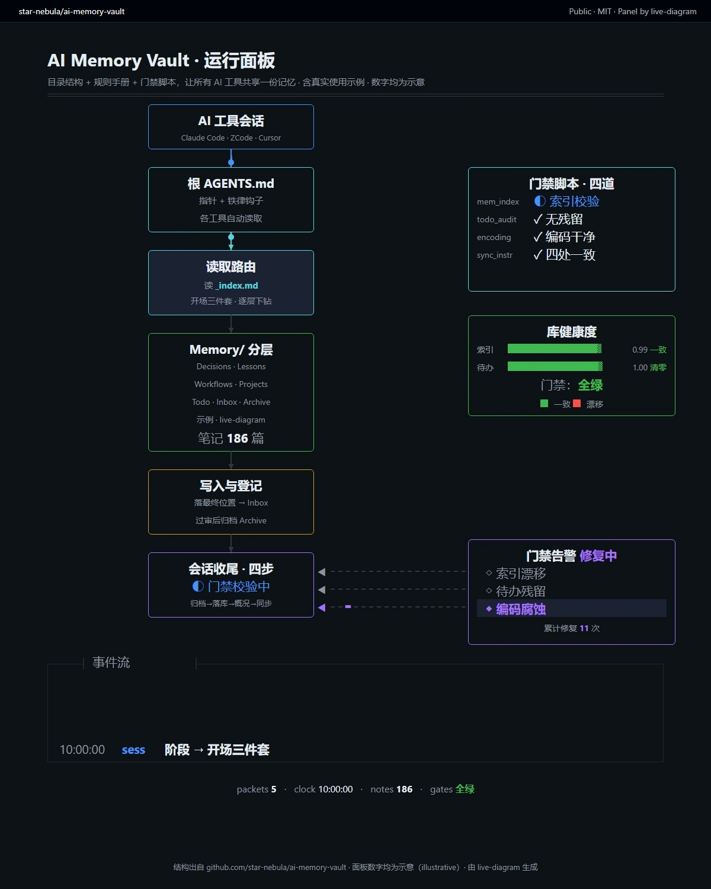

# live-diagram · 活的架构图

把**一份 JSON 配置**渲染成版面固定的运行动画架构图：连线上光点流动、日志滚动、计数跳动、仪表条翻状态、侧栏告警逐格扫过——产出 **H.264 mp4**（X / 小红书 / 抖音 / B 站）或**可在浏览器直接打开的动态网页**。也是一个 [AI agent skill](SKILL.md)。



*循环播放：用本 skill 渲染的 AI Memory Vault 运行面板（GitHub 暗色主题；数字均为示意）。静态示例截图见 [examples/rag-pipeline/screenshots/](examples/rag-pipeline/screenshots/)。*

核心理念（重写自 [ythx-101/live-panel-skill](https://github.com/ythx-101/live-panel-skill) 的方法，代码全部独立实现）：

- **版面不动，动的是系统状态**——任何一帧截出来都是完整可读的图
- **确定性渲染**：页面暴露 `window.seek(t)`，一切可见变化都是 `t` 的纯函数（无墙钟、无 Math.random、无 CSS 动画）→ 逐帧截图可复现、可校验
- **处处一个事实**：日志由各状态机在状态变化时自动产出，屏幕上互相对得上是机制保证的
- **无真实数据必须标注**示意；复刻他人作品必须署名

## 主题（theme.preset）

| preset | 风格 |
| --- | --- |
| `github-dark` / `github-light` | GitHub 默认风格：官方配色、系统无衬线字体、6px 圆角、顶栏式标题栏 |
| `blueprint` | 蓝图工程风：深蓝图纸底 + 网格、白色细线盒 + 四角定位标、菱形光点、图签式标题栏 |
| `terminal-dark` | 终端暗色：等宽字体、文本模式分段边框盒子、macOS 三色点标题栏（上游同款风） |
| `light-pastel` | 浅色粉彩信息图 |

## 使用

依赖：Python 3.8+（仅标准库）、Chrome/Chromium/Edge、ffmpeg。Windows / macOS / Linux 均可。

```bash
# 渲染 mp4（--html-out 同时保留动态网页）
python scripts/livediagram.py render --config my.json --out my.mp4 --html-out my.html --crf 10 --preset slow

# 版面自检（~120 个时刻 DOM 测量）+ 导出 PNG + 回放逐像素一致性验证
python scripts/livediagram.py check --config my.json --out-dir frames --repeat

# 只生成动态网页（浏览器打开即活的；?t=秒 可定格任意帧）
python scripts/livediagram.py build --config my.json --out page.html
```

作为 AI skill 使用：把本目录放进你的 agent 的 skills 目录（如 `~/.zcode/skills/`、`~/.claude/skills/`），SKILL.md 会自动被识别。

## 文档

- [SKILL.md](SKILL.md) — 固定工作流程与动法速记
- [references/motion-grammar.md](references/motion-grammar.md) — 动法：三节奏、处处一个事实、确定性
- [references/config-schema.md](references/config-schema.md) — 配置字段表（画幅 5 种：4:5 / 3:4 / 1:1 / 9:16 / 16:9）
- [examples/rag-pipeline/](examples/rag-pipeline/) — 完整示例（config + 成片 mp4 + 动态网页 + 截图）

## 致谢

动法与样式学自 [@thedelost](https://x.com/thedelost) 的 Codex agent 面板 clip（经 [@slashui](https://x.com/slashui) 引用传播）。本项目为该方法的独立重实现，未使用其代码；Windows 原生支持（stdlib WebSocket 驱动 Chrome）为本仓新增。

## License

[MIT](LICENSE)
